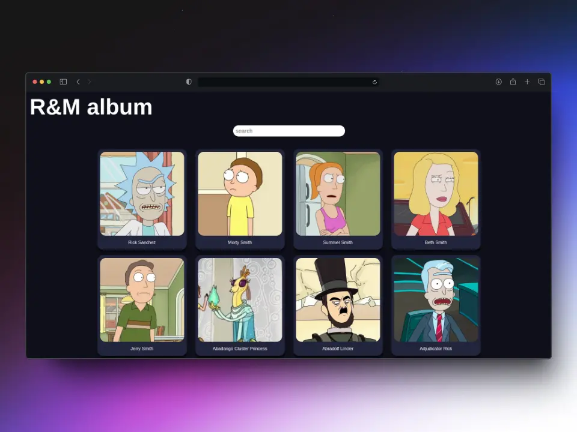

# GOROAPI 

Rick and Morty album using microservices in Go and Node.js
<!--
<style>
    #con-img {
        overflow: hidden;
        border-radius: 20px;
    }
    img {
        border-radius: 20px;
        transform: scale(108%);
        transition: all ease-in-out .2s;
    }
    img:hover {
        transform: scale(100%);
    }
</style>
-->

<div id="con-img">
    
</div>


# Install

## Gen RSA keys
```sh 
ssh-keygen -t rsa -b 2048 -m PEM -f jwt.key
openssl rsa -inform PEM -in jwt.key -pubout > jwt.key.pub
```
Then move the keys to different directories.
```sh
mv jwt.key client
mv jwt.key.pub server
```

## Using Docker

### Docker compose
```sh
docker compose up -d
```

### Bash script
```sh
bash scripts/build.sh
```

## Manual

### Client
```sh
cd client
```
```sh
npm i
```
```sh
npm run dev
```
or
```sh
npm run build
```
```sh
node dist index.js
```

### Server
```sh
go run cmd/web/main.go
```
or
```sh
go build -o goroapi cmd/web/main.go
```